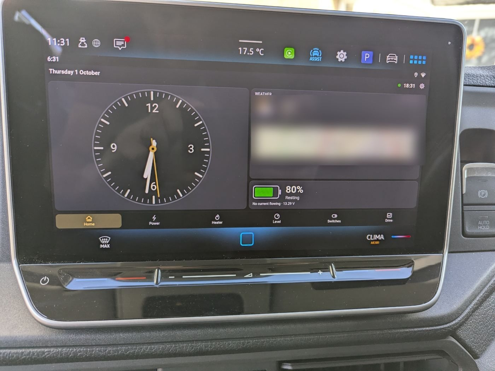
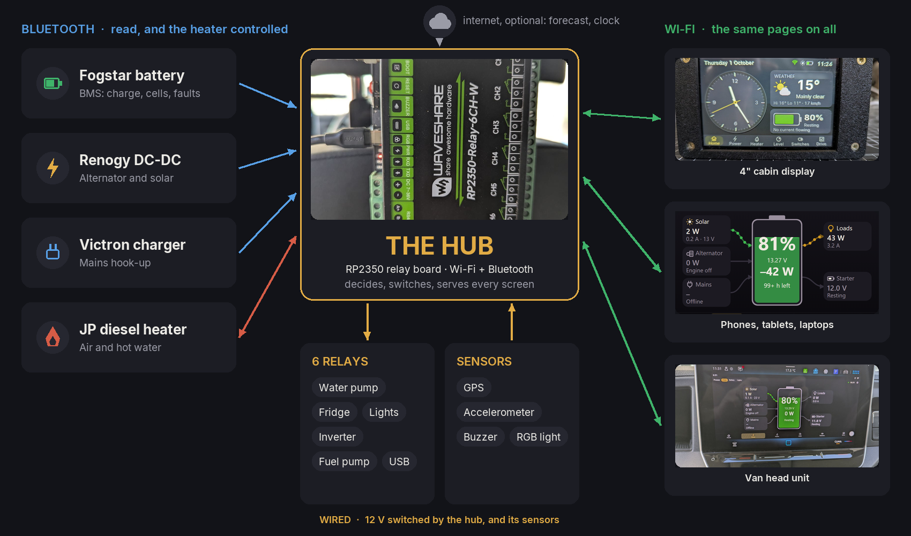
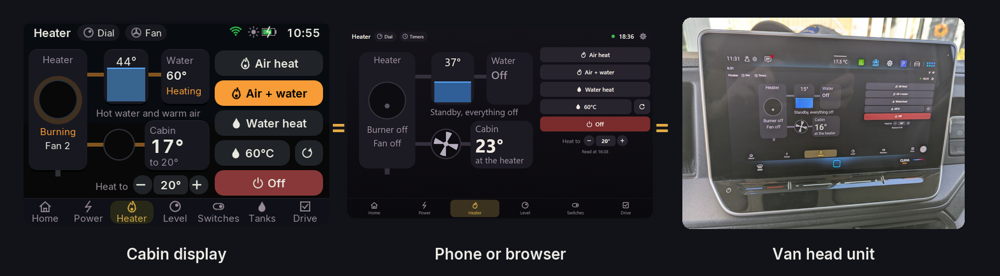
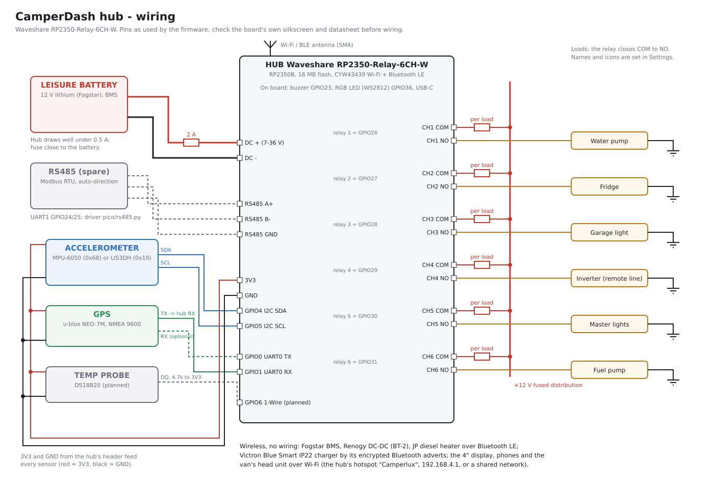
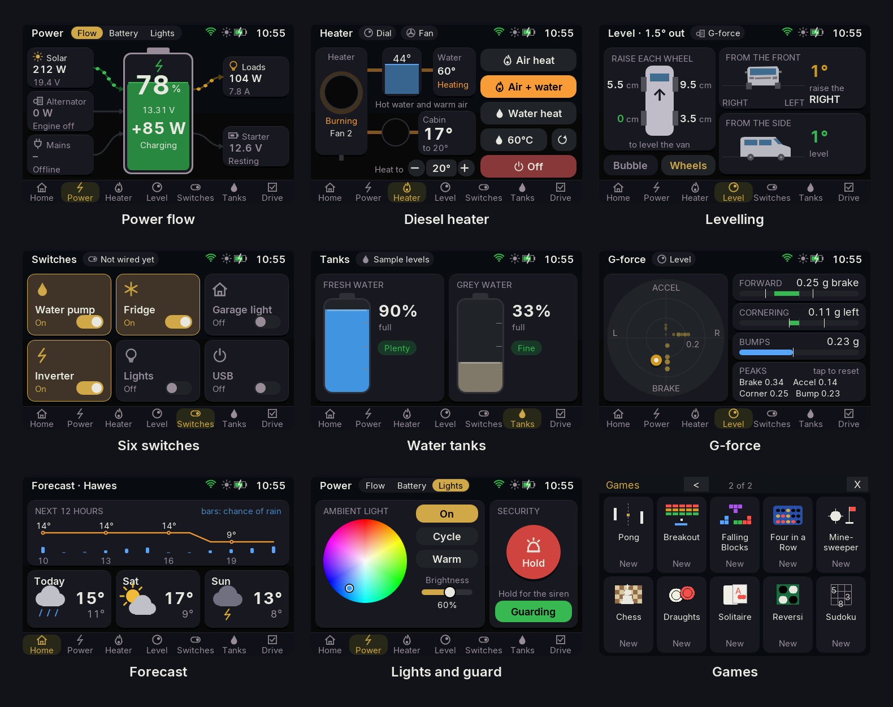

# CamperDash

**Campervan monitoring and control, built and run in a VW Crafter conversion.**
Battery, chargers, diesel heater, six 12 V switches, levelling, GPS and weather,
on every screen in the van.



**[Brochure (PDF)](docs/brochure/CamperDash-Brochure.pdf)** · **[Set one up](docs/SETUP_GUIDE.md)** · **[Connect your devices](docs/DEVICES.md)** · **[Wiring](docs/HARDWARE.md)**

## How it fits together



**One page, every screen.** The display, phones and the van's head unit all show the same pages, from the hub.



**Wiring.** One board, fused feeds, six relays, two sensors. The details are in [docs/HARDWARE.md](docs/HARDWARE.md).




On the van's network, open **http://camperlux.local**, or the hub's address. More detail is in [docs/ARCHITECTURE.md](docs/ARCHITECTURE.md).

## What it does



- **Battery:** Fogstar/JBD BMS state of charge, voltages, current, cells, temperatures and faults, with a live power-flow diagram (solar, alternator, mains, loads), and storage mode for lay-up.
- **Chargers:** Renogy DC-DC (BT-2) for alternator and solar; Victron Blue Smart IP22 for mains.
- **Heater:** JP/SolGP CR12 diesel combi.
  - Air, water, air + water, and fan only.
  - Fan speed, a target temperature dial, timers, frost protection, and "auto" fuel (electric on hook-up).
- **Switches:** six relays, each with a name and icon you choose. They survive restarts and can be switched from any screen.
- **Levelling:**
  - A bubble view, plus how far to raise each wheel.
  - Small tilts within the 1° tolerance are shown as level.
- **G-force, for driving:** a view on the Level page showing a g-ball, forward / cornering / bump bars and peaks.
  - The hub keeps the last 15 minutes of readings, so a drive can be looked at afterwards, even one out of Wi-Fi range.
- **Tanks:** fresh and grey water levels, with a warning when fresh runs low or grey fills up. These show sample levels until tank sensors are fitted.
- **GPS and weather:** the clock, the forecast for the van's position, the place name, and a map.
- **Alerts and security:** low battery, faults, driving off plugged in, guard mode and a panic siren. They're shown and sounded on every screen, and on the hub's buzzer and LED. The hub has a password, and displays are paired.
- **The cabin display:**
  - Swipe navigation (Home round to Drive, with the Camperlux logo between the ends), draggable sliders, night mode, alarm clock and kitchen timer.
  - It shuts down on battery and wakes on charge.
  - It updates over Wi-Fi with automatic rollback.
  - An Easter egg: tap the logo three times for 20 games.
- **Apps:**
  - The hub serves the web app, so any browser works.
  - The Android app finds the hub, updates itself, and has an Android Auto view.
  - Every screen shows the same pages and features. Only the games are on the cabin display alone.

Supported devices today: **Fogstar** (JBD BMS), **Renogy** DC-DC, **Victron**
IP22, **JP** diesel heater. Others can be added; see
[Adding a device](docs/ARCHITECTURE.md#adding-a-device).

## Documentation

| Document | For |
|---|---|
| [docs/SETUP_GUIDE.md](docs/SETUP_GUIDE.md) | Building one: from a blank hub to a working van |
| [docs/DEVICES.md](docs/DEVICES.md) | Connecting each device: Bluetooth equipment, relays, accelerometer, GPS, the display |
| [docs/AI_SETUP_PROMPT.md](docs/AI_SETUP_PROMPT.md) | A ready prompt for an AI assistant to guide that setup |
| [docs/HARDWARE.md](docs/HARDWARE.md) | Parts list and prices, the pin map, the wiring schematic, safety |
| [docs/ARCHITECTURE.md](docs/ARCHITECTURE.md) | How it fits together, the modules, and how to add a device |
| [docs/HUB_API.md](docs/HUB_API.md) | The hub's HTTP API |
| [docs/REQUIREMENTS.md](docs/REQUIREMENTS.md) | User and system requirements, with how each is verified |
| [docs/level_drift/](docs/level_drift/README.md) | Levelling sensor drift: test data and findings |
| [docs/gforce_tests/](docs/gforce_tests/README.md) | G-force view: two drive tests and what they showed |

## Repository layout

| Path | What it is |
|---|---|
| `pico/` | Hub firmware: MicroPython, deployed as bytecode |
| `static/` | The web app and settings pages, served by the hub |
| `display/` | Cabin display firmware (ESP32-S3) |
| `android_hub/` | Android app: discovery, the WebView, self-update, Android Auto |
| `firmware/` | Our MicroPython board definition for the hub, built by GitHub Actions |
| `tools/` | Build, deploy, preview, test and analysis tools (each explains itself at the top) |
| `tests/` | PC-side tests |
| `docs/` | The documents above, the schematics, screenshots and the brochure |
| `research/` | Scripts used to work out the device protocols |
| `android/` | The original direct-to-hardware Android app (superseded) |

## Quick reference

```bash
# hub (USB)
python tools/build_mpy.py
python tools/deploy_mpy.py --port COM13 --go

# cabin display: first time over USB, then over Wi-Fi through the hub
python tools/deploy_display.py --port COM11 --go
python tools/publish_display.py --hub-port COM13 --go

# developing
python tools/dev_web.py --hub <ip>          # the pages locally, against a real hub
python tools/preview_display.py out/        # every display page as PNG, with an overflow check
python tools/test_games.py out/             # the games, run on the PC
python tools/check_all.py                   # every check below, in one go
```

## Testing

`python tools/check_all.py` runs everything, on the PC, with no hardware.
GitHub runs it on every push (the "Checks" workflow).

| Check | What it covers |
|---|---|
| `tests/test_protocols.py` | The battery, DC-DC, Victron and heater protocols, against the original PC versions in `research/`; every heater command byte for byte |
| `tests/test_hub_rules.py` | Alerts (low battery, battery health, driving off plugged in), frost protection and its safety stops, Wi-Fi retries and the hotspot, the trip and stall recorders |
| `tests/test_wifi_scenarios.py` | The hub and the display finding each other: the hub's and the display's real Wi-Fi code, run together through ten situations (driving off, arriving home, the edge of range, the display out of range and back), in a quiet place and a busy one (`tests/wifisim.py`) |
| `tests/test_security.py` | Real requests through the hub's web server, with and without the password; the password check; connections that stall |
| `tests/test_display_logic.py` | The display's page order, sliders, heater dial and fan, G-force, tanks and wheel heights |
| `tests/test_level_calibration.py` | The levelling maths |
| `tools/test_games.py`, `tools/preview_display.py` | The games run, and every display page draws without text overflowing |
| Compiles, page scripts | Every module compiles for its board; the web pages' scripts are valid |

`tests/hubsim.py` loads the hub's code on the PC: it stands in for the
hardware and leaves out `main.py`'s start-up, so its functions can be called
directly.

Not covered by these, and tested on the hardware instead: the drivers (screen,
touch, sound, radio), Bluetooth and Wi-Fi timing, and anything that needs the
real devices.

## Security notes

- **The heater ignites a diesel burner.** Set the hub password before putting the hub on any network you don't control, and never expose the hub to the internet.
- **Secrets aren't in the repository:** `pico/config.py`, `display/config.py`, `.ota_key` and `research/local_secrets.py` are all kept out.

## Licence

CamperDash is free for **non-commercial use**: your own van, hobby builds, research, teaching and charities.

- **The software** is under the [PolyForm Noncommercial License 1.0.0](LICENSE.md).
- **The documentation, photos and brochure** are under [CC BY-NC-SA 4.0](LICENSE-docs.txt).
- **Commercial use**, such as selling the system, kits, installations or products built on it, needs a licence from Camperlux: get in touch through [camperlux.co.uk](https://camperlux.co.uk).
- Parts from others keep their own licences: see [NOTICE.md](NOTICE.md).

## Protocol notes

The BMS, DC-DC, Victron and heater protocols were worked out from live
captures and, for the heater, from a decompiled vendor app. The decoders in
`pico/` document each byte and how it was confirmed.
