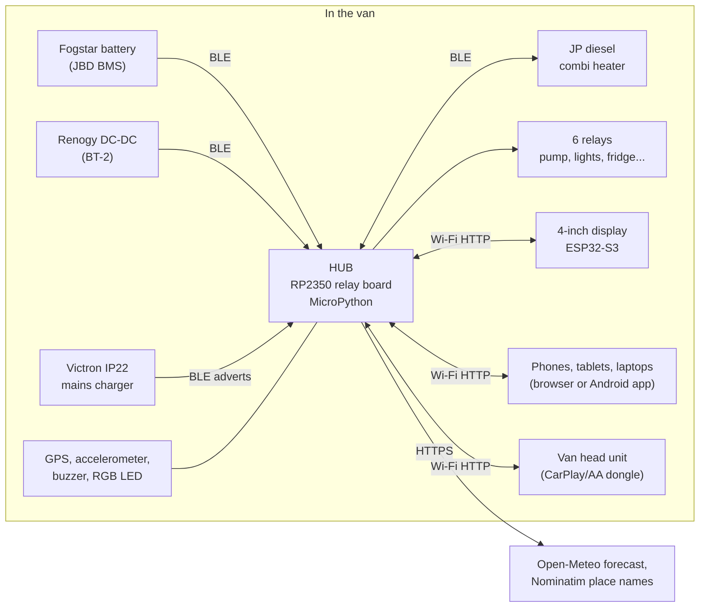

# Architecture

How CamperDash is put together, what talks to what, and where to make a
change. For wiring, see [HARDWARE.md](HARDWARE.md); for the hub's HTTP
interface, [HUB_API.md](HUB_API.md).

## The system

**The hub is the single source of truth.**
- It polls the devices, keeps the state, makes every decision (alerts, timers, frost protection, storage mode, guard), and serves the pages.
- Every screen is a client of the hub's HTTP API, so all of them always show the same thing.
- The display and the phones don't talk to the van's equipment directly.

## Components

| Part | Code | Runs on |
|---|---|---|
| Hub firmware | `pico/` (compiled to `.mpy` by `tools/build_mpy.py`) | Waveshare RP2350-Relay-6CH-W, MicroPython 1.29 (our build, `firmware/`) |
| Web app | `static/app.html` (the dashboard), `settings.html`, `common.js`, `app.css` | Served by the hub; any browser. iPhone: Safari, "Add to Home Screen" |
| Cabin display | `display/` | Freenove ESP32-S3 4", MicroPython 1.29 |
| Android app | `android_hub/` (Kotlin, WebView + discovery + Android Auto) | Android 8+; the APK is served by the hub at `/camperlux.apk` |
| PC tools | `tools/` | Python 3 on the developer's PC |

### Hub modules (`pico/`)

| Module | Job |
|---|---|
| `main.py` | Start-up, the main loops, alerts, timers, storage mode, guard, relays, Wi-Fi, discovery, the API handlers |
| `httpd.py` | A small async HTTP server: routes, auth (password, pairing, API token), static files |
| `settings.py` | Runtime settings in `settings.json` (which override `config.py`), with validation |
| `ble_hub.py`, `ble_raw.py` | Bluetooth LE central: connects and polls the BMS, DC-DC and heater; listens for Victron adverts |
| `jbd.py`, `renogy_dec.py`, `victron_dec.py`, `jp_heater.py` | Device protocols (each file documents its bytes) |
| `level.py` | Accelerometer: averaging, stillness, calibration, axis mapping, drift log |
| `gps.py`, `place.py`, `weather.py` | GPS (NMEA), place name (Nominatim), forecast cache (Open-Meteo) |
| `indicate.py`, `rs485.py` | Buzzer and RGB patterns; RS485 Modbus driver (spare) |

### Display modules (`display/`)

| Module | Job |
|---|---|
| `main.py` | Tasks: polling the hub, touch, Wi-Fi hunting, pairing, OTA, games, the alarm, power |
| `ui.py` | Every page, drawn into a framebuffer; hit-testing; sliders |
| `hub.py` | Finding the hub (last address, UDP discovery, fallbacks) and requests |
| `gfx.py`, `aa.py`, `icons.py`, `slide.py` | Drawing: fonts, anti-aliasing (viper), icons, page-swipe compositing |
| `st7796.py`, `ft6336.py`, `sound.py` | Drivers: screen, touch, ES8311 audio |
| `ota.py`, `otaboot.py`, `boot.py` | Updates over the air, with automatic rollback |
| `shutdown.py` | Sleeps on battery, wakes on charge |
| `arcade.py`, `game.py`, `g_*.py` | The games: 20 of them, opened by three taps on the logo |

## Key mechanisms

**Discovery.** Clients broadcast `camperdash?` on UDP 50505 and the hub
replies. If that fails:
- **The display** tries the network the hub last said it was on, then the hub's hotspot, then its other known networks.
  - If the hub stops answering for a minute on a network that's still working, the display moves on, and passes that network over for 3 minutes. That way it keeps trying the hub's hotspot instead of going back to wait on a network the hub has left.
  - It logs each network it joins, or fails to join, on its USB serial output.
- **The hub's Wi-Fi is a small state machine** (`_wifi_check` in `pico/main.py`): it's either *joined* to a known network or on its *hotspot*, and only that function moves it between the two.
  - The hub's single radio routes the internet through whichever connection was set up last, so starting the hotspot takes the route away from the network connection. Whenever the hotspot has started, the network connection is set up again before it's relied on. Without that, after a drive away and back, the hub was on the home network with no internet.
  - Its web server drops connections that send nothing within 10 seconds, and any connection after 2 minutes. Connections stranded by a network change otherwise filled its few slots and stopped it answering.
- **The hub** keeps its hotspot up whenever it isn't on a network of its own.
  - It switches the hotspot off only to try joining a known network it can hear.
  - A network it can hear but can't join, such as at the edge of range, is retried after 1, 2, 5 and then 10 minutes, not every 15 seconds.
  - `tests/test_wifi_scenarios.py` runs both devices' real code through eight situations (driving off, arriving home, the edge of range, the display carried away and back, and others), each in a quiet place and a busy one.
- **The Android app** remembers the hub's address on each network, also finds the hub when the phone itself is the hotspot, and offers Android's Wi-Fi panel to join the hub's hotspot.

**Security.**
- **Password:** set on the hub; the pages ask for it before changing anything.
- **Pairing:** the display pairs by showing a 6-digit code that you type into the hub.
- **API token:** for scripts.

**Display updates.**
1. `tools/publish_display.py` puts a signed build on the hub (HMAC with `.ota_key`, which is never committed).
2. The display checks 2 minutes after starting, then hourly, or straight away from the hub's Settings.
3. It installs only when idle.
4. `otaboot.py` restores the previous version if the new one fails to start. Versions only move forward.

**Hub updates** are over USB only: `tools/build_mpy.py`, then
`tools/deploy_mpy.py --go`. That tool checks the bytecode's ABI and the free
space on the hub before writing anything.

**One view, everywhere.** The cabin display (`display/ui.py`) and the web app
(`static/app.html`) draw the same pages from the same data. The web app is
what the Android app, iPhone Safari and the van's head unit all show. Only the
games are display-only. When a page or view is added to one, add it to the other
in the same change.
- **Tanks:** the display's `_page_tanks` and the web app's `renderTanks`. They show sample levels until `/api/data` carries `tanks`.
- **G-force:** the display's `gforce_sample` / `_page_gforce` and the web app's `gSample` / `renderGforce`, using the same formulae (see [gforce_tests/](gforce_tests/README.md)).

**The trip recorder.** `level.py` keeps the last 3000 level readings in
memory, about 15 minutes at the level loop's pace, and `GET /api/level/trip`
streams them as CSV. A drive is then all there afterwards, even out of Wi-Fi
range: `tools/level_drift.py trip` charts it.

**Wi-Fi rejoin.** Having lost its network, the hub retries every 15 s for
five minutes, then backs off to `WIFI_RETRY_S`.

**Nothing may hold the loop.** Everything on the hub takes turns in one
asyncio loop, so any wait that doesn't hand over its turn (`time.sleep`, a
Wi-Fi scan, a DNS lookup) stops the level readings, Bluetooth and the pages
too. The hotspot's start-up wait now hands over its turn; it held the hub for
up to 5 s whenever it left the home network. Two waits remain that
MicroPython can't do in the background: a Wi-Fi scan (about a second) and
the hotspot coming up. `pico/stalls.py` records every hold-up over 0.5 s with
what had just started (`GET /api/stalls`), and `tools/level_drift.py trip`
lists them and shades them on a drive's chart.

**Inside the Android app.** The app keeps the page clear of the system bars
itself, so the page drops its own safe-area padding when it finds `; wv)` in
the user agent.

## Adding a device

New integrations are written against this source code. The project was built
with an AI coding assistant (Claude Code), and that's a practical way to add
one:

1. **Capture the device's protocol.** Use its own app's Bluetooth traffic, its documentation, or a decompiled vendor app (as was done for the heater). `research/` has the PC scripts used before.
2. **Write a decoder in `pico/<device>_dec.py`.** Keep it small and pure: bytes in, a dict out. Document every byte and how you confirmed it.
3. **Add polling in `ble_hub.py`** (or `rs485.py` for a wired Modbus device) and a settings entry for its address in `settings.py`.
4. **Expose its state in `/api/data`** (`main.py` `api_data`), and show it in `static/app.html` and `display/ui.py`.
5. **Test on the bench, then in the van.**

Memory is no longer the constraint it was on the Pico W: about 300 KB is free
on the RP2350.

## Constraints worth knowing

- **Bluetooth LE is the busiest part of the hub.** One radio serves Wi-Fi, a central connection to each device, and the Victron scanning. Keep new BLE work short and don't hold connections open needlessly.
- **The heater must not be talked to unprompted.** Heater polling is off (`HEATER_POLL = False`), and the hub only sends heater commands that a person or a timer asked for.
- **Hotspot address.** The hub's hotspot is fixed at 192.168.4.1 by the Wi-Fi driver (see [HARDWARE.md](HARDWARE.md#networking)).
- **The display uses MicroPython**, which lacks parts of CPython: no `random.shuffle`, and no `str.capitalize`. `tools/test_games.py` checks for these.
