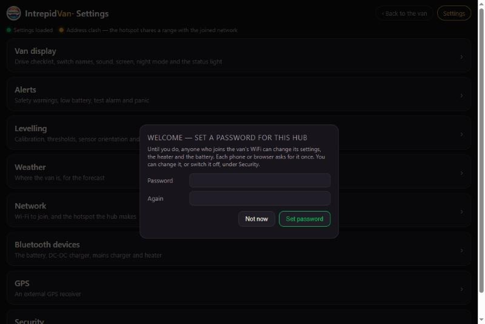
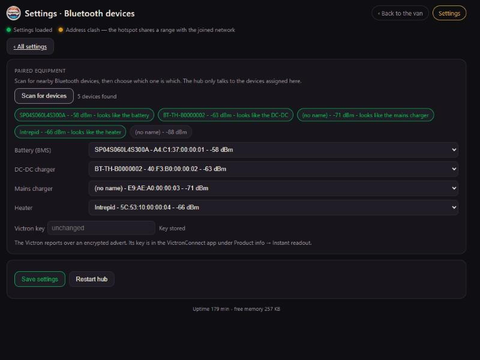
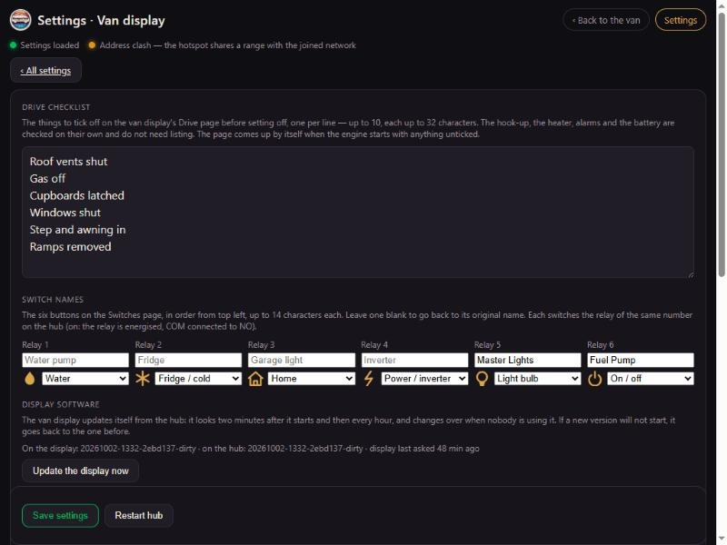
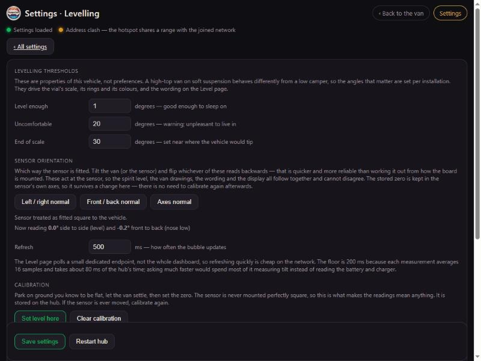

# Connecting your devices

How to connect each part of the van to the hub once the hub is running: the
Bluetooth equipment, the relays, the sensors and the cabin display. Wiring and
pin numbers are in [HARDWARE.md](HARDWARE.md); getting the hub running in the
first place is in [SETUP_GUIDE.md](SETUP_GUIDE.md).

Everything here is done on the hub's **Settings** page: open the hub's address
in a browser, then **Settings** (top right), or go to `http://<hub>/settings`.

> The screenshots come from a test setup with made-up device addresses. Your
> names, addresses and signal strengths will differ.

## 1. Set the hub password first

The first time Settings opens, the hub asks you to set a password. **Do it before
anything else.** Until a password is set, anyone who joins the van's Wi-Fi can
change the settings, run the heater and switch the battery off.

- **What it protects:** settings, the heater, frost protection, timers, storage mode, guard mode, the battery's switches, the relays and restarting the hub.
- **How often you're asked:** each phone or browser asks for it once, then remembers a key worked out from it (never the password itself).
- **What stays open:** anyone on the van's Wi-Fi can still see everything, set the lights and use panic.
- **Forgotten it?** It can be cleared over USB from a computer.

Change it later under **Settings → Security**.

**Seeing a password.** Every password box in Settings has an eye button that shows what's in it. On a box left blank for a password the hub already holds, such as the hotspot's, a saved network's or the Victron key, it fetches that password from the hub and shows it for 30 seconds. This needs the hub password, so it only works once one is set. The hub password itself can't be shown, because the hub never stores it.

## 2. Bluetooth equipment

The hub talks to the battery, the DC-DC charger and the heater over Bluetooth,
and listens to the Victron mains charger's broadcasts. Nothing is wired between
them.

### Before you scan

- **Everything is switched on** and within about 10 m of the hub. Bluetooth reaches less far through a metal van body and battery boxes.
- **The makers' phone apps are closed:** Xiaoxiang or JBD, DC Home, VictronConnect and the heater's app. Most of these devices accept **one connection at a time**, so a phone that's connected keeps the hub out.
- **The Renogy DC-DC has its BT-2 Bluetooth module** plugged into its communication port. The charger has no Bluetooth of its own.

### Scan and assign

1. Go to **Settings → Bluetooth devices** and press **Scan for devices**. The scan takes about six seconds.
2. Each device found appears as a chip with its name and signal strength. The hub recognises the ones it knows ("looks like the battery") and fills any empty role with them.
3. Check the four drop-downs (**Battery (BMS)**, **DC-DC charger**, **Mains charger**, **Heater**) and correct any the hub got wrong. A device you don't have stays on "not set".
4. Press **Save settings**.

How each device appears in the list:

| Role | Shows in the scan as | Recognised by |
|---|---|---|
| **Battery** (Fogstar / JBD BMS) | A code like `SP04S060L4S300A` or `DP04S…`, or a name with "JBD" or "xiaoxiang" | Its name |
| **DC-DC charger** (Renogy, via BT-2) | `BT-TH-` and the end of its address, e.g. `BT-TH-1A2B3C4D` | Its name |
| **Mains charger** (Victron Blue Smart IP22) | Often **no name**, just "(no name)" and an address | Victron's maker code in its broadcast |
| **Heater** (JP / SolGP diesel combi) | `Intrepid` or a name with "SolGP" | Its name |

The strongest signal (the number closest to zero, such as −58 dBm) is usually
the nearest device. That helps if there are other vans around.

### The Victron key

The Victron's broadcasts are encrypted, so the hub needs the charger's own key.
You copy it once from the VictronConnect app. The wording varies a little
between app versions:

1. In **VictronConnect**, open the charger, tap **⚙** (settings), then **⋮** → **Product info**.
2. Make sure **Instant readout via Bluetooth** is **on**.
3. Next to **Instant readout details**, tap **Show** and copy the **encryption key**. It's 32 characters of 0–9 and a–f.
4. Paste it into **Victron key** on the hub's Bluetooth devices page, then press **Save settings**.

The 6-digit **Bluetooth PIN** (000000 out of the box) is *not* this key. The PIN
is only for VictronConnect connecting to the charger.

### Check each one is working

Open the dashboard (**‹ Back to the van**), then **Power**. Within a poll or two
(5–10 seconds):

| Device | Working when |
|---|---|
| Battery | The battery shows its charge (%) and voltage |
| DC-DC charger | Solar and Alternator show watts, or 0 W with the engine off and no sun |
| Mains charger | Mains shows a reading while the van is on hook-up. **With no hook-up it shows Offline, which is correct:** the charger only broadcasts while it has mains power. |
| Heater | The **Heater** page shows its state after pressing the refresh button (↻). The hub only talks to the heater when asked. |

### Make the equipment harder to tamper with

These devices accept a connection from anyone nearby with the maker's app.
The heater can be started that way. Where a device offers a PIN or password,
set one in its own app:
- **Victron:** change the PIN from 000000 in VictronConnect.
- **Battery:** some JBD firmware has a password in the Xiaoxiang app.

The hub doesn't need these PINs. It reads the Victron's broadcasts, and the
battery, charger and heater connections don't use them.

## 3. Relays and switches

Each of the hub's six relays is one button on the **Switches** page.

1. **Wire the load to its relay:** fused +12 V to **COM**, **NO** to the load's +. Relay channel *n* on the board (CH*n*) is **Relay *n*** in Settings. Wiring and ratings are in [HARDWARE.md](HARDWARE.md#relays).
2. In **Settings → Van display → Switch names**, name each relay (up to 14 characters) and choose its icon. Leave a name blank to go back to the default.
3. Press **Save settings**, then try each switch from the dashboard's **Switches** page and check the right thing comes on.

Relays remember their state through a restart of the hub. The same page holds
the **Drive checklist**: the things to tick off before setting off, one per line.

## 4. The accelerometer (levelling, G-force, guard mode)

1. **Wire it** to 3V3, GND, GPIO4 (SDA) and GPIO5 (SCL) (see [HARDWARE.md](HARDWARE.md#accelerometer-levelling-guard-mode)). Mount it **rigidly**, any way round.
2. Make sure levelling is on (`LEVEL_ENABLED = True` in the hub's `config.py`; it's on unless switched off).
3. **Calibrate:** park on ground you know to be flat, let the van settle, then press **Settings → Levelling → Set level here**. The hub refuses if the van is still moving. Recalibrate whenever the sensor is moved.
4. **Set the orientation:**
   - Raise the **right** side a little (a ramp under the right wheels, or lift the sensor). The Level page should say the right side is high, "raise the LEFT". If it says the opposite, press **Left / right normal** to flip it.
   - Raise the **front**. It should say nose high. If not, press **Front / back normal**.
   - If raising the side moves the *front/back* reading instead, the sensor is turned 90°: press **Axes normal** to swap the axes, then check both again.
   - The orientation is kept separately from the calibration, so you don't need to calibrate again after changing it.
5. **Thresholds** set when the van counts as level ("Level enough", 1° by default), when to warn, and the end of the scale.

Drift: the sensor's zero moves by about 0.06° per °C. That's normal, and stays
inside the 1° "level enough" tolerance (see [level_drift/](level_drift/README.md)).

## 5. The GPS

1. **Wire it** to 3V3, GND, and the GPS's **TX to GPIO1**, the hub's receive pin. Its RX to GPIO0 is optional.
2. Make sure the pins in the hub's `config.py` are `GPS_UART = 0`, `GPS_TX_PIN = 0` and `GPS_RX_PIN = 1`.
3. In **Settings → GPS**, switch it **on** and save.
4. Within a minute or two outdoors, the same page shows **Fix: latitude, longitude · N satellites**. The first fix after fitting can take several minutes, and it doesn't work inside a garage.

With a fix, the hub sets its clock and uses the van's position for the forecast,
the place name and the map on Home. To keep the forecast on one place instead,
choose **Fixed location** in **Settings → Weather**; that card always says which
location the forecast is for.

## 6. The cabin display

A display pairs instead of having the password typed into it:

1. When the display needs to change something, it shows a **6-digit code**.
2. Within three minutes, enter it in **Settings → Security → Van display → Code on the display**, and press **Pair**.
3. The display is listed as paired. To remove one later, click **unpair** next to it there; it will show a new code to pair again.

The display finds the hub by itself on any shared network, or on the hub's
hotspot.

## 7. Phones and the van's screen

These need no set-up on the hub. See [SETUP_GUIDE.md](SETUP_GUIDE.md#6-phones-and-the-vans-screen):
open the hub's address in a browser (iPhone: **Add to Home Screen**), or
install the Android app from **Settings → Network → Download the Android app**.

## 8. Restarting, and starting again

- **Restart the display:** tap the clock at the top of the display to open its panel, then **Restart**, and confirm. Settings are kept, and it's back in about half a minute.
- **Restart the hub:** **Settings → Restart hub** on any phone or browser.
- **Factory reset:** this clears everything the device has been told, for when the hub password is forgotten, or before passing the van on. No password is needed: having a hand on the board is the permission. The full list of what's cleared and kept is in the hub's **Settings → Security**.
  - **The hub:** with it running, hold the **BOOT** button on the board for **10 seconds**. From 2 seconds its light flashes red and it beeps each second. At 10 it gives a long beep, clears everything and restarts on the values in its `config.py`. Let go earlier to cancel.
  - **The display:** with it running, hold the **BOOT** button on the back for **10 seconds**. It counts down on the screen, then clears its pairing, learned networks and preferences, and shows a code to pair again. It keeps its software, update key and touch calibration. A short press still turns the screen off and on.
  - **Not while switching on.** Holding BOOT while the power is connected puts either board into firmware-loading mode instead. Nothing is lost; disconnect and reconnect the power to carry on.
  - **For a truly blank hub,** for example to hand it on, also replace its `config.py` over USB. It holds the hotspot name and password from installation.

## Troubleshooting

| Symptom | Try |
|---|---|
| A device isn't in the scan | Is it switched on and in range? Is its phone app closed? Scan again. The Victron only broadcasts while it has mains power. |
| A device was assigned but shows nothing | Its app is connected and keeping the hub out: close the app. Move the hub or device closer. Check the address under Bluetooth devices is still the right one. |
| Victron readings look wrong | The key is mistyped. Copy it again from VictronConnect. |
| Levelling arrows point the wrong way | Step 4 above: flip **Left / right** or **Front / back**, or swap the **Axes**. |
| "The van is not still" when calibrating | Wait for the van to settle (nobody moving inside), then try again. |
| GPS never gets a fix | Outdoors? Check GPS TX goes to GPIO1 (the hub's receive pin), and `GPS_UART = 0`. |
| The hub password is forgotten | Factory reset the hub (section 8), or clear the password over USB from a computer |
| A relay doesn't switch its load | Check the fuse and the COM/NO wiring. Relay *n* is channel CH*n* on the board. |
