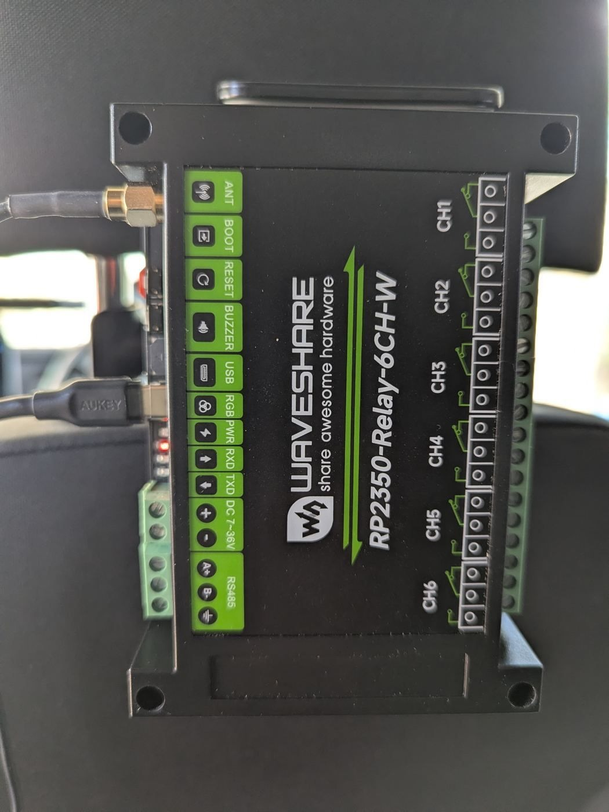
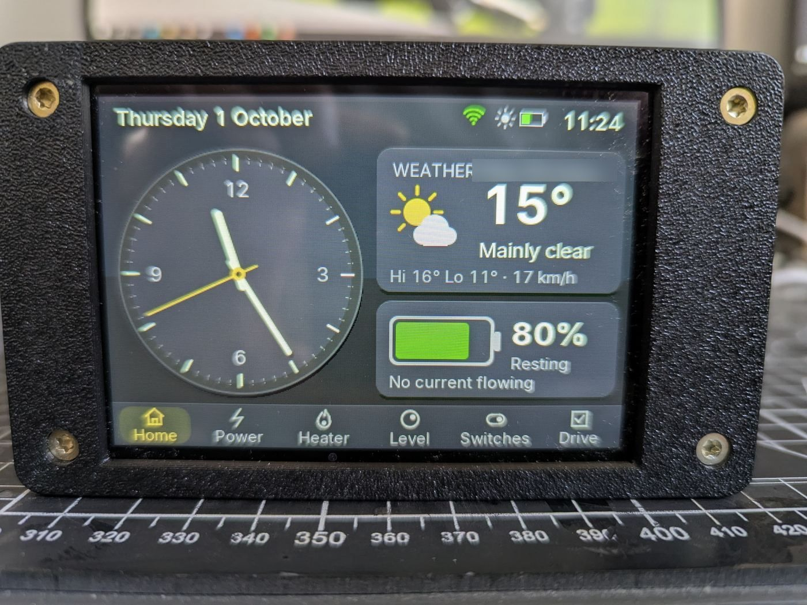

# Hardware

The parts, how they are wired, and the pins the firmware uses. If you are
adding CamperDash to a van, read **Safety** first.

*The schematic is drawn by `tools/make_schematics.py`. Change the script and
redraw it when the wiring changes.*

## Parts list

| Part | What it does | Approx. price |
|---|---|---|
| **Hub:** Waveshare RP2350-Relay-6CH-W | The brain. It has six relays, Wi-Fi and Bluetooth LE, a buzzer, an RGB LED and RS485, and takes a 7–36 V supply. It mounts on a DIN rail. | £40 |
| **Cabin display:** Freenove FNK0104S, ESP32-S3, 4" 480×320 touch | Wall display with a speaker and a battery | ~£30 |
| **GPS:** u-blox NEO-7M module | Location, time, and the forecast position | ~£10 |
| **Accelerometer:** MPU-6050 (GY-521), or LIS3DH | Levelling and guard mode | ~£5 |
| DS18B20 temperature probe *(planned)* | A temperature reading on a 1-Wire bus | ~£3 |
| Fuses, holders, cable, enclosure | — | varies |

**Total: about £85** for the hub, display, GPS and accelerometer.

## The hub: Waveshare RP2350-Relay-6CH-W

The terminal blocks are labelled on the case:
- **Left side:** antenna, BOOT and RESET buttons, buzzer, USB, RGB LED, power, the supply in (DC 7–36 V) and RS485.
- **Right side:** the six relays, CH1 to CH6.

- **Processor:** RP2350B (48 GPIO, 520 KB RAM) with 16 MB flash.
- **Radio:** CYW43439 for Wi-Fi and Bluetooth LE. It sits on GPIO 32–35 (REG_ON 32, DATA 33, CS 34, CLK 35).
- **Firmware:** no official MicroPython build supports this board's Wi-Fi. It runs our own build of **MicroPython v1.29.0**, from [`firmware/boards/WAVESHARE_RP2350_RELAY_6CH_W`](../firmware/boards/WAVESHARE_RP2350_RELAY_6CH_W). The "Hub firmware" GitHub workflow builds it (`.github/workflows/firmware.yml`, artifact `hub-firmware-v1.29.0`).

### Pin map

| Function | GPIO | Notes |
|---|---|---|
| Relays CH1–CH6 | 26, 27, 28, 29, 30, 31 | High = relay on. Switch *n* in Settings drives relay *n*. |
| Buzzer | 23 | PWM at about 2 kHz. Used for alerts (`pico/indicate.py`). |
| RGB status LED (WS2812, GRB) | 36 | Shows alert and connection state. |
| RS485 | UART1: TX 24, RX 25 | Auto-direction (no DE pin). Driver: `pico/rs485.py` (Modbus RTU). Spare. |
| I2C (accelerometer) | SDA 4, SCL 5 | 400 kHz. MPU-6050 at 0x68, or LIS3DH at 0x19. |
| GPS | UART0: TX 0, RX 1 | NMEA at 9600 baud. Only the hub's RX matters: GPS TX goes to GPIO1. |
| DS18B20 *(planned)* | 6 | 1-Wire, with a 4.7 kΩ pull-up to 3V3. |
| Wi-Fi/BLE | 32–35 | Internal; don't use these pins. |

**UART1 is RS485 on this board.** That's why the GPS uses UART0, on GPIO 0/1.
The old Pico W hub used GPIO 8/9 for the GPS. The pins in the live hub's
`pico/config.py` are the source of truth.

### Power

- Feed **DC+ / DC−** from the leisure battery through a **2 A fuse** close to the battery.
- The hub draws well under 0.5 A.
- **Don't power the hub from a circuit the BMS discharge switch cuts**, if you can avoid it. Switching the BMS discharge MOSFET off from the dashboard would otherwise cut the hub's own power. The pages ask for a typed confirmation for that reason.
- USB-C powers it on the bench and is the programming port.

### Relays

- Each channel has **COM**, **NO** and **NC** terminals. CamperDash closes COM to NO when a switch is on.
- Wire them for **high-side switching**: fused +12 V to COM, NO to the load's +, and the load's − to the negative bus.
- **Fit a fuse per load**, sized for that load's cable.
- **Check the relay rating on Waveshare's datasheet** before switching anything heavy. For big loads, such as an inverter's main feed or a compressor fridge's start current, use the relay to switch a contactor or the device's remote/enable line, not the load itself.
- Relay states are saved and restored after a restart.

## The cabin display: Freenove FNK0104S (ESP32-S3)

- **Firmware:** MicroPython v1.29.0 (ESP32_GENERIC_S3, SPIRAM_OCT). The app is in `display/`.
- **Screen:** ST7796, 480×320 over SPI (SCK 12, MOSI 11, CS 10, DC 46, backlight 45).
- **Touch:** FT6336 over I2C (SDA 16, SCL 15, RST 18, INT 17, address 0x38). It reads two fingers, for two-player Pong.
- **Sound:** ES8311 codec at 0x18 on the same I2C bus, with I2S (BCK 5, WS 7, DOUT 8). The amplifier enable is GPIO 1, active low.
- **Status LED:** a WS2812 on the back, GPIO 42.
- **Power:**
  - Runs from its own battery, charged over USB-C.
  - With no charger it shuts itself down, then wakes when it's plugged in again.
  - In a van, feed it from a 12 V-to-USB supply.

## Sensors

### Accelerometer (levelling, guard mode)

- **Wiring:** VCC to 3V3, GND to GND, SDA to GPIO4, SCL to GPIO5.
- **Mounting:** mount it rigidly. Any orientation works, because Settings → Levelling sets swap and invert per axis.
- **Calibration:** calibrate it with the van on known-flat ground.
- **Drift:** the MPU-6050's zero drifts by about 0.06° per °C. See [`level_drift/`](level_drift/README.md). The Level page draws the van level within the 1° tolerance, so normal drift doesn't show.

### GPS

- **Wiring:** VCC to 3V3, GND to GND, GPS TX to GPIO1. GPS RX to GPIO0 is optional.
- **What it's used for:** setting the clock, the forecast position, the place name, and the map on Home.
- **Turning it on:** `GPS_ENABLED`, or Settings → Location.

## Wireless devices (no wiring)

| Device | Link | Driver |
|---|---|---|
| Fogstar lithium battery (JBD BMS) | Bluetooth LE, connected | `pico/` BMS decoder |
| Renogy DC-DC charger, via BT-2 | Bluetooth LE, Modbus | `pico/renogy_dec.py` |
| Victron Blue Smart IP22 charger | Bluetooth LE adverts, encrypted (key from VictronConnect) | `pico/victron_dec.py` |
| JP diesel combi heater (SolGP / CR12) | Bluetooth LE, connected | `pico/jp_heater.py` |

You pair them on the hub's Settings page; each has a scan button. To add a
device type, see [ARCHITECTURE.md](ARCHITECTURE.md#adding-a-device).

## Networking

- **Joining networks:** the hub joins the first known Wi-Fi network it can see.
- **Its own hotspot:** "Camperlux" by default. It runs whenever no known network is in range, so the hub can always be reached.
- **Hotspot address:** 192.168.4.1. This is fixed by the Wi-Fi driver: its DHCP server starts on the default address, so changing the address in software leaves clients unroutable.
- **Hotspot at home:** if your home network uses 192.168.4.x (or a wider range that covers it), the hub turns its hotspot off while joined there, to avoid the clash.
  - **To have both at once:** the fix is a firmware build that sets `CYW43_DEFAULT_IP_AP_ADDRESS` in the board header.

## Safety

- **The heater's diesel burner can be started from any screen.**
  - Set a hub password before connecting the hub to a network you don't control.
  - Never expose the hub's web server to the internet.
- **Relays switch real loads.** Fuse every circuit and check the relay ratings.
- **The BMS controls are dangerous:** charge and discharge MOSFET switching can cut the van's 12 V supply.
- **This is a hobby project.** It isn't certified for any safety function. Don't rely on it as the only protection for people, pets or equipment.
