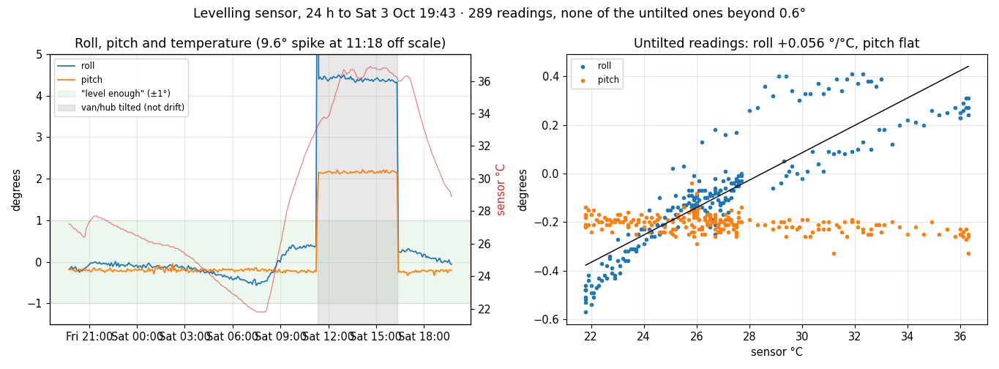

# Levelling sensor drift: test results

The van's levelling sensor appeared to drift. These recordings were made to find
out why, and to decide whether it needed a software correction.

- **Sensor:** MPU-6050 on the hub board (Waveshare RP2350-Relay-6CH-W), I2C 0x68, 5 Hz low-pass filter.
- **Temperature:** the sensor chip's own die temperature, which runs a few °C above the cabin.
- **Tool:** `tools/level_drift.py`. Its `watch` job polls live; its `analyse` job charts and fits the data.

## Files

| File | What it is |
|---|---|
| `2026-10-01_overnight_hub_log.csv` / `.png` | The hub's own drift log, 21:30–07:25: 120 readings at 5 min intervals, all with the van still. |
| `2026-10-02_heater_warmup_live.csv` / `.png` | PC live recording at 5–10 s intervals, 08:10–09:10. The heater ran in Water + air mode from 08:11. |
| `2026-10-02_hub_log_overnight_and_warmup.csv` / `.png` | The hub log to 09:14, covering both periods. |
| `2026-10-03_hub_log_day.csv` / `.png` | The hub log for the 24 h after the decision below, Fri 19:43 to Sat 19:43: 289 readings, a cold night and a sunny day. |

**Hub log columns:** `t` (unix), `temp_c`, `roll`, `pitch` (calibrated, degrees), `raw_roll`, `raw_pitch`, `ax`/`ay`/`az` (g).

**The live CSV also has:** `steady`, `off_by`, the heater's mode, on and fan state, `cabin_c` and `bms_c`. The heater fields come from the hub's last-known heater state; heater polling is off, so they can be stale.

## Results

### 1. Overnight, slow cooling (30.3 → 24.3 °C over 10 h)

| | Range | Link to temperature |
|---|---|---|
| Roll | −0.55° to −0.96° | +0.059 °/°C, r = 0.95; 0.15° left after removing the temperature effect |
| Pitch | 0.12° to 0.33° | none (r = 0.08); noise only |

### 2. Heater warm-up, fast heating (24.4 → 36.7 °C in about 55 min)

- **08:11–08:43:**
  - Roll rose from −0.89° to +0.02°, at 0.125 °/°C (r = 0.99), about twice the overnight slope.
  - Pitch was flat, between 0.10° and 0.26°.
- **08:43 onwards:**
  - Roll peaked, then drifted back down by about 0.04° every 5 min while the temperature levelled off: −0.13° at 09:03.
  - It was heading for the overnight line, about −0.20° at 36.7 °C.
- The van counted as still for every reading, so the heater's fan did not disturb the sensor.

### 3. A day with the new drawing (Fri 2 Oct 19:43 to Sat 3 Oct 19:43, 21.8 → 36.9 °C)



- **Roll** followed the temperature at **+0.056 °/°C** (r = 0.88), confirming the slope from the first night. Its range was −0.57° (07:30, coldest) to +0.41° (late morning, warming fast).
- **Pitch** stayed between −0.33° and −0.04°, with no link to temperature.
- **Not one reading went beyond the 1° tolerance**, and only six beyond 0.5°. All six were around dawn, when it was coldest.
- **The morning warm-up overshot again,** as in test 2. Roll reached +0.4° at about 31 °C, then settled back to +0.25° by 36 °C.
- **11:18 to 16:18 is a real tilt, not drift.**
  - The readings jumped to 4.4° roll and 2.2° pitch, held there for five hours, then returned to the old line at 16:23.
  - The single 9.6° reading at 11:18 caught the move itself.
  - Those readings are left out of the figures above.

**Result:** the drawing's 1° tolerance covers the drift. The hub's drift log is no longer needed (Settings → Levelling → **Log off**).

### What it means

- **Steady state:** roll follows the sensor temperature at about **0.06° per °C**. Pitch is unaffected.
- **Fast heating:** while the temperature changes quickly, roll overshoots by up to about **0.5°**. This is most likely uneven heating of the board, with the die temperature reading lagging the part that matters. The overshoot fades over about 30 min once the temperature settles.
- **Mounting:** nothing physical moved, because pitch stayed steady throughout.
- **In practice:**
  - A 20 °C swing between night and day gives about 1.2° of false roll.
  - A normal night gives about 0.5°.
  - A heater warm-up adds up to about 0.5° for half an hour.

## Decision (2026-10-02)

There is no software temperature correction for now. Instead, the Level page's van drawings, on both the display and the web page, are drawn level within the "level" tolerance (Settings → Levelling, 1° by default). Beyond it, only the excess is drawn, magnified ×3.

**Why:** most of the drift stays within 1°. The old drawing magnified every angle ×3, so 1° looked like 3°, which gave a false impression of a badly tilted van.

**If more precision is ever needed**, here is a correction model that fits these recordings:

```
roll_corrected = roll - 0.059 * (T_smoothed - T_at_calibration)
```

- **T_smoothed** is the die temperature put through a slow low-pass filter, with a time constant of about 10–15 min. This handles the warm-up overshoot.
- Fit and check the model against all three recordings here before deploying it.
- Roll and pitch could also get separate tolerances.
